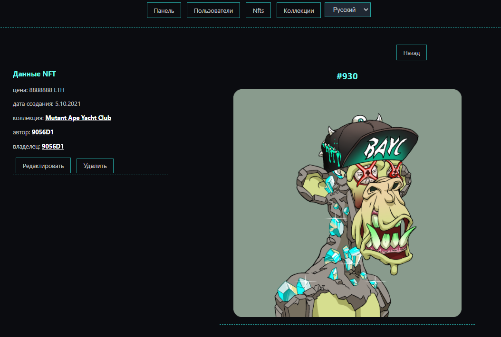

# Frontend Development Project

This app is strongly inspired by [Opensea.io](https://opensea.io/) platform, but I created my own API server to get the data I want. If you are interested in it check README in the "/backend" folder. All app is to show I can use some of the front-end frameworks, mostly React and Redux. The app has no practical use but feels free to check it out.


## Instalation

Go to "/frontend" directory and run:

```s
npm install
```

Repete for "/backend".

## Run

In bouth "/frontend"  and  "/backend" run comand:

```s
npm start
```


